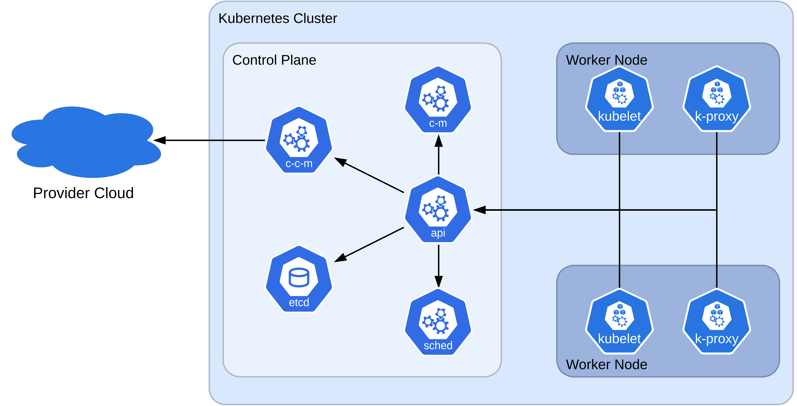

# Introduction

Welcome to the Kubernetes Basics workshop! Over the course of this workshop, we will take a look at the various Kubernetes core API Ressources, accompanied by practical examples for you to follow along. We will also scratch the surface on more advanced topics, such as Operators and Helm Charts.

## What is Kubernetes?

> Kubernetes, also known as K8s, is an open source system for automating deployment, scaling, and management of containerized applications. _Source: [kubernetes.io](kubernetes.io)_

Kubernetes is a container orchestrator to support the deployment and management of containerized applications. Originally developed as "Project Borg" as early as 2008, Kubernetes even predates Docker, which was announced in 2013. In 2014, the project was open-sourced and afterwards handed over to the Cloud Native Computing Foundation (CNCF).

### What is Cloud-Native?

> Cloud native is the software approach of building, deploying, and managing modern applications in cloud computing environments. [...] _Source: [aws.amazon.com](aws.amazon.com)_

Cloud-native describes a philosophy to design tools and workloads that work in a cloud environment. Everything that runs in Docker also runs on Kubernetes. However, this does not necessarily mean that the workload takes advantage of the available tools. An important note: Kubernetes is not synonymous with "the cloud". There are many other components that make up modern cloud infrastructure, of which Kubernetes is one part. Cloud vendors such as AWS offer a range of other services in addition to managed Kubernetes.

So what makes the Cloud different from traditional deployments? A major difference is that the Cloud is designed to be elastic: it can scale up and down based on demand, thus, in theory, reducing cost, as one only has to pay for what is required.

Being elastic comes with its own set of challenges: while scaling up, additional instances are created. These new instances must be discovered as available endpoints, and requests need to be routed to them.

### Why not Docker Compose?

This is a reasonable question to ask at some point, and the answer depends entirely on the use case and requirements: Docker (Compose) scales vertically, not horizontally. It only offers a basic set of tools to manage containers, which, compared to Kubernetes, is fairly inflexible.

Because it only scales vertically, redundancy across multiple nodes is harder to achieve: manual synchronization and management are necessary. Docker Swarm mode is one way to scale across multiple nodes, but the user base is small compared to Kubernetes. This does not mean that it is bad, but the community and enterprise support for Kubernetes results in a larger number of projects and support, which we can benefit from.

### How is Kubernetes different?

Kubernetes is built from the ground up to scale: normal clusters can support up to 5000 nodes, but much larger clusters with up to [130.000 nodes](https://cloud.google.com/blog/products/containers-kubernetes/how-we-built-a-130000-node-gke-cluster/) have been built as well. Horizontal scaling of workloads is built in and enabled by default. Mechanisms for service discovery and load-balancing are also integrated.

A key design of Kubernetes is that it is modular: the core API provides the basic resources and is fairly stable, but is also extensible with custom resources. These resources are not treated as third-class citizens, but behave like native resources in the cluster.

To administer a cluster, the API server is the central entity to talk to: the intended cluster state, that is, everything that should be present in the cluster, is defined declaratively. The control plane then takes care of reconciling the actual state towards the intended state. This also works in the case of failure: if the actual state drifts because of e.g. a node failure, workloads are automatically migrated to another node to restore the cluster to the intended state.

### Who should use Kubernetes?

So, who should actually use Kubernetes? Kubernetes makes sense for:

- Hyperscalers that need to scale up and down dynamically
- Mission-critical services that need guaranteed uptime
- Enterprise users to simplify the management of complex microservice architectures
- For Cloud vendors to sell the service to customers at a premium

If you are neither of the above, does Kubernetes also make sense for the Homelab and self-hosters? 

The good news: Kubernetes can run perfectly with just a single node, and thus does not need many servers. Even a single-node K8s host can have benefits over a Docker VM, for example the API model and the ecosystem that builds around it, or the fact that nodes can be added later to scale if needed without any modifications. Additionally, redundancy across multiple nodes can reduce the downtime of self-hosted services and protect against hardware failures. Together with GitOps tools, very powerful Infrastructure-as-Code can be achieved.

Finally, since Kubernetes is the de facto standard for running containers in the Cloud, getting to know the tools can be beneficial when aiming for a job.

### Who shouldn't use Kubernetes?

Compared to a Docker VM, Kubernetes is much more complex and has a steep learning curve. From experience as a self-hoster: in sum, the time you will spend refining your setup compared to the time you will save through automations will not add up. The path to a refined setup can be very long, and even if you are there, you need operational knowledge to diagnose and remediate failures.

Additionally, backups are more complicated compared to a simple Docker host. There exist some good backup tools, but the process is still more complicated compared to backing up a single Docker host.

Finally, the ecosystem that Kubernetes offers you only makes sense if you actually use it: there are many interesting automations and integrations, which can save you a lot of time. But if you do not have a use case for them, you will spend more time learning Kubernetes than using it.

## Cluster Architecture

Before we dive into the hands-on part of this workshop, let's briefly take a look at how a Kubernetes cluster is built.

Kubernetes introduces a split between the administration of the cluster, which is done by the control plane, and the actual workloads, which are run by worker nodes.

### Control Plane

The control plane is responsible for managing the cluster: it observes the cluster state and continuously reconciles it to the intended state. The control plane can be replicated on multiple nodes, providing failure tolerance. Production deployments typically use dedicated nodes for the control plane, but the control plane can also be co-located with a worker node.

**API Server**: The central component of the control plane is the API server. It is responsible for handling incoming API requests and delegating tasks to the various other control plane components.

**etcd**: To store the intended state and everything else that makes up the cluster, a highly available etcd Key-Value Database is used. The database also stores events, which are generated in the cluster, similar to logs.

**kube-scheduler**: Analogous to a CPU-scheduler, this component is responsible for deciding on which worker node a new Pod should be run. For this, it takes available resources into account, and other constraints, some of which can be set manually.

**kube-controller-manager**: The controller manager observes the cluster state and reacts to specific events. If an event occurs, it reacts according to the programmed semantics. It also translates high-level tasks into smaller operations to accomplish the overall goal. For example, if one service replica becomes unavailable because a node went down, but we want three replicas of the service, the controller manager will initiate the creation of an additional replica, to restore the cluster to the intended state. The controller manager thus implements the Kubernetes-specific logic and behavior of the core API resources, which we will get to know later.

**cloud-controller-manager (optional)**: This component is relevant for Cloud- and managed deployments, where external resources need to be provisioned based on state within the cluster. For example, if a load-balancer is created within the cluster, this controller coordinates the creation of the external load balancer in the cloud-provider ecosystem to be used with the cluster. For local deployments, this component is not needed.

### Worker Nodes

The worker nodes are responsible for running the workloads that the control plane schedules on them. They also monitor the health of their containers and report back to the control plane if something does not behave as expected. Worker nodes also have to provide networking for all containers, such that containers can communicate with containers on other worker nodes.

**kubelet**: The kubelet is an agent that runs on all worker nodes. It receives commands from the control plane and ensures that containers that are scheduled on this node are running and are healthy.

**kube-proxy (optional)**: The kube-proxy implements networking mechanisms on the worker nodes to enable communication between containers on different nodes. This component can also be turned in favor of a dedicated networking plugin.

**Container Runtime**: The container runtime is responsible for running the containers on the worker nodes. The kubelet interacts with the runtime to manage the lifecycle of containers, that is, their creation, health checks, and destruction.

**Cluster DNS**: A DNS server that can be run within the cluster itself. It is used by all containers in the cluster to resolve DNS queries. Dynamic DNS records are automatically created to facilitate service discovery.

### Plugins: CRI, CNI, and CSI

As mentioned previously, Kubernetes is built to be modular: to fulfill various use-cases, from high-performance cloud environments to resource-constrained edge devices. Additionally, having modularity and well-defined interfaces makes it possible to decouple the development of the components from Kubernetes itself, enabling faster release cycles.

Kubernetes introduces three major interfaces that allow for the swapping out of central components in the cluster: the Container Runtime, Network, and Storage Interfaces.

**Container Runtime Interface (CRI)**

The CRI is a standardized interface between the kubelet and the container runtime component. This makes it possible to swap out the container runtime entirely. Possible options include `containerd`, `CRI-O`, and `Docker`.

**Container Network Interface (CNI)**

An interface for Pod networking. Its job is to assign Pods IP addresses within the cluster, and to facilitate the connectivity between Pods. The interface is realized as an API, which is called whenever a Pod is created and destroyed. Every Pod in the cluster receives its own IP address. Additional features, such as network policies, are optional and are not supported by all network plugins.

**Container Storage Interface (CSI)**

The CSI is an interface to integrate custom storage providers into a cluster. Both block-level and file-level storage are supported. Using the CSI, Kubernetes can request storage for Pods in a provider-agnostic way. Popular examples for storage providers are `Ceph / Rook`, `Longhorn`, or `local-path`.

## Kubernetes Distributions

There is a whole Zoo of Kubernetes distributions: Google has its Google Kubernetes Engine (GKE), Rancher its Rancher Kubernetes Engine (RKE), and Amazon offers its own managed Kubernetes service. Additionally, distributions for local or self-managed clusters are available, such as K3s, K0s, or MicroK8s. For development purposes, distros such as Kind or minikube can be used.

However, where are the differences, and which one should I use? While they seem different, the core API model should be identical for all Kubernetes distributions. The CNCF even [certifies](https://www.cncf.io/training/certification/software-conformance/) Kubernetes distributions for core API compliance.

However, there can still be minor differences when it comes to, e.g., third-party plugin support, how certain features are implemented (e.g., cloud-provider managed load-balancer vs. self-hosted load-balancer), or how the cluster is administered, e.g., self-managed or cloud-managed.

Which distro to use depends on your use case: if you are already a customer of a cloud provider, the choice is likely obvious. If you want to self-host a cluster, I would recommend distros like `K3s` or `Talos Linux`. For local development, `kind` or `minikube` are great.

For our workshop today, we will be using [K3s](https://k3s.io/) due to its lightweight nature. In K3s, all control plane components run in a single binary. The installation is almost trivial using an installer script. Despite being minimalistic, K3s is still flexible enough to support self-hosted and local deployments, making it perfect for our use case.

So let's dive in and [setup our cluster](01-cluster-setup.md).